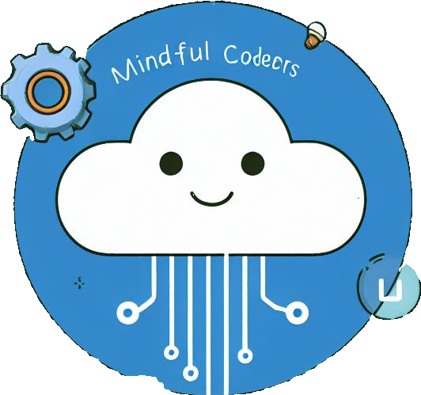

# Revision API
Built by the team Mindful Coders  🧘‍♀️👩‍💻



## Our Team 

Mindful Code(o)rs

"Consistent progress paves the way – one commit at a time."
## Our team members:

Victoria Bristow [@Victoria-Plum](https://github.com/Victoria-Plum)  

Nada Shetty [@nashetty](https://github.com/nashetty)

We both have Master's level degrees in psychology - we know our Freud and Jung!  Code First Girls brought this team together and inspired our love of coding. The Mindful Coders superpower is team work and cooperation - that's why we are excited to use GitHub to help each other grow as master coders!  

<div style='text-align: center;'>
<span style='color: gold;'>

###################################################

<span style='color: Blue;'>

## Introduction to our API

</span>

###################################################

</span>
</div>

Do you want to improve your knowledge of **Python**, **JavaScript** and **SQL**? This API could help you in that journey!

Once your server is up and running you can access the following.

---

<div style='text-align: center;'>
<span style='color: purple;'>

## Questions and Answers

</span>
</div>

This API contains questions and answers to topics in **Python**, **JavaScript** and **SQL** that could challenge you to improve your knowledge. Following successful connection to the API the review questions can be accessed via the URL below. This will bring up a list of all available questions for all three languages

```python
url = "http://127.0.0.1:5000/questions"
```

---

<div style='text-align: center;'>
<span style='color: purple;'>

## Focus on specific langauge

</span>
</div>

You can select between:

1. **Python**,
2. **JavaScript**
3. **SQL**

Which means you can focus your learning on the langague or languages you need. Following successful connection to the API the review questions can be accessed via the URL below. This will bring up a list of all available questions for your chosen language - simply type the chosen langauge at the end of the URL

```python
url = "http://127.0.0.1:5000/questions/language/(your language choice)"
```

---

<div style='text-align: center;'>
<span style='color: purple;'>

## Mastery level

</span>

</div>

You can track your progress with our mastery level feature, this allows you to assess your level of mastery from 0 - 10 - this section can be updated as you progress through the levels - so you can watch your mastery levels rise.

---

<div style='text-align: center;'>
<span style='color: purple;'>

## Add or delete questions

</span>
</div>

You can guide your own learning journey by using the option to add or delete questions and answers - enabling you to focus on the topics and concepts you need to master in order to reach your learning goal.

---

<div style='text-align: center;'>
<span style='color: purple;'>

## API endpoints

</span>
</div>

| Method | Path                                      | Additional Info                                             | Result                                           | Status Code | Response         |
| ------ | ----------------------------------------- | ----------------------------------------------------------- | ------------------------------------------------ | ----------- | ---------------- |
| GET    | /questions                                |                                                             | all questions                                    | 200         | questions array  |
| GET    | /questions/:id                            |                                                             | question with a particular id if it exists       | 200         | question         |
| GET    | /questions/language/:programming_language |                                                             | questions for a particular language if it exists | 200         | questions array  |
| POST   | /questions                                | { 'language': string, 'question': string, 'answer': string} | create a new question                            | 201         | created question |
| PATCH  | /questions/:id                            | { 'mastery': int }                                          | updated mastery level                            | 200         | updated question |
| DELETE | /questions/:id                            |                                                             | question deleted                                 | 200         |                  |

---

<div style='text-align: center;'>
<span style='color: magenta;'>

# Getting started with the API -

## what files are included and what do they do?

 </span>
</div>

This API contains several files which are listed below alongside the related installation requirements. The installation requirements use the 'pip install' method:

```bash
pip install mysql.connector
```

Other installation requirements for a file will involve importing information from another file in the API - for example db_utils needs to import information from config.py to function.

1. main.py
2. app.py
3. db_utils.py
4. config.py
5. revision.sql
6. .gitignore

<div style='text-align: center;'>
<span style='color: magenta;'>

### "main.py"

</span>
</div>

The client-side shapes the user experience and provides code that enables a user to interact with the API. Our API client side enables the user to chose between 6 options, which includes being able to add or delete questions, update mastery level and view questions by ID or by language.

The following imports are needed for this file - requests uses the "pip install" method, json and sys are built in packages

```python
import requests
import sys
import json
```

The main.py creates a way for users to interact with the API by typing in requests on a webpage - this means the API is more user friendly and accessible to students who want to study programming languages.

<div style='text-align: center;'>
<span style='color: magenta;'>

## "app.py"

</span>
</div>

The app.py file is the document that creates the flask file. The flask file is the web based URL which enables the 'front end' of the API to be built.

The following imports were needed for this file - the "pip install" method is needed for flask- but the other imports refer to another file associated with this API "db_utils" - which will be described below.

```python
 from flask import Flask, jsonify, request
 from db_utils import (
 DbConnectionError,
 UserError,
 get_all_questions,
 get_question_by_id,
 get_questions_by_language,
 create_new_question,
 delete_question_by_id,
 update_mastery_by_id,)
```

<div style='text-align: center;'>
<span style='color: magenta;'>

## "db_utils.py"

</span>
</div>

The code in db_utils is the 'backend' connection, which sets out the instructions for connecting to the database. The instructions from this file will set out the type of requests that are possible. Connections within an API can go wrong, db_utils conducts a function called "exception handling" - which detects specified errors and returns a message back to the user if the database was unable to connect.

The following imports are needed for the db_utils.py file - note that as well as mysql.connector (which needs to be installed in the terminal using the "pip install" method) db_utils connects to information from config.py - which will be described next

```python

import mysql.connector
from config import USER, PASSWORD, HOST

```

<div style='text-align: center;'>
<span style='color: magenta;'>

## "config.py"

</span> 
</div>

In order to connect the MySQL file and Python files you will need to populate the HOST, USER and PASSWORD - the PASSWORD will be the one set up when you downloaded MySQL

The **config.py** - you will need to create this file inside the `question2` folder with the following content

```python
HOST="********"
USER="********"
PASSWORD="******"
```

<span style='color: red;'> **Important note**: </span> The HOST, USER, AND PASSWORD should be treated as confidential information and never posted or shared in a public domain - so if you share your work on GIT HUB please redact and display similar to above. For infomration security we added this file to .gitignore to prevent it accidentally being pushed to GitHub

<div style='text-align: center;'>
<span style='color: magenta;'>

## "revision.sql"

</span>
</div>

The MySQL file contains the data needed for the API - in this case all the information about the revision questions that API users can access or ammend to support their learning needs.

<div style='text-align: center;'>
<span style='color: magenta;'>

## ".gitignore"

</span>
</div>

This file sets out what information should not be shared via Git - for example the code that prevents the config.py files being shared on the Git repository.

```python
# exclude config.py from being commited and pushed to GitHub
config.py

```

## Installation

1. Clone the Repository
```bash
git clone https://github.com/nashetty/revision-api.git
cd revision-api
```

2. Install libraries
To be able to run the client and server side please install essential libraries, you can either do this manually using the "pip install" method for each of the required libraries (all listed in `requirements.txt`) or use the following command in the terminal to install all the dependencies in one go.

```python
pip install -r requirements.txt
```
3. Configure and seed the database
Ensure you have MySQL installed locally. Before running the project, you need to create the database and required tables by executing the `revision.sql` script in MySQL Workbench or any other MySQL client of your choice. This will provide you with an initial data set.

Update the database configuration parameters in the config.py file with your MySQL credentials.
```python
  # config.py
  HOST = '127.0.0.1'
  USER = 'root'
  PASSWORD = 'YOUR PASSWORD'
```

## Running the code - what you will do and see

Once installation has been successfully completed you will need to run the server by executing the following command

```python
python app.py
```

then you can start the client side by executing the following command

```python
python main.py
```

Then you will greeted by the revision app. You be offered 6 choices

1. to display all the available questions and answers
1. to select questions by language (Python, JavaScript or MySQL)
1. to add your own question and help other learners
1. to find a question using the id number
1. to delete a question incase you want to remove a question
1. to update your mastery level - your mastery level starts at zero - but work hard and reach 10

Please make your selection and happy coding :)
